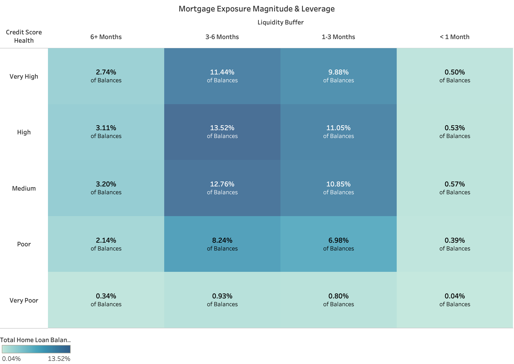

# Customer Analytics & Mortgage Risk Dashboard for Retail Banking

## Overview

This project explores customer behavior, mortgage exposure, and repayment risk within a fictional Australian retail bank, HarbourLine Bank Australia (HBA).

Using Tableau, I developed an executive dashboard designed to help decision-makers better understand customer tenure, mortgage portfolio exposure, repayment stress indicators, and retention opportunities. The dashboard combines customer demographics, lending data, credit health metrics, liquidity measures, and behavioral indicators to support proactive portfolio management.

[Live Dashboard](https://public.tableau.com/app/profile/fred.rinaldo/viz/MIS771A3_17699162989440/Dashboard1)


---

## Business Problem

Like many Australian lenders, HBA operates in an environment shaped by rising living costs, interest rate sensitivity, and changing employment conditions.

While mortgage lending remains a major source of revenue, it also represents a significant source of risk. HBA's leadership wanted to better understand:

- How customer relationships evolve over time
- Where mortgage exposure is concentrated
- Which customer segments display early indicators of repayment stress
- Which customers represent long-term strategic value
- How to balance portfolio risk management with customer retention

The objective was to transform customer and lending data into actionable insights that support executive decision-making.

---

## Dataset

The analysis was developed using a synthetic retail banking dataset containing customer demographic, financial, lending, engagement, and risk-related information.

The dataset includes:

- Customer demographics
- Relationship tenure
- Product ownership
- Home loan balances
- Credit scores
- Deposit balances
- Industry risk classifications
- Delinquency indicators
- Digital engagement metrics
- Loyalty and rewards information

To keep the repository lightweight, a representative sample dataset and complete data dictionary are included.

---

## Analytical Approach

The dashboard was designed around a progression from customer understanding to portfolio prioritization.

Key analytical dimensions included:

- Customer tenure and relationship maturity
- Mortgage exposure
- Credit score health
- Financial leverage
- Liquidity buffers
- Industry risk
- Delinquency indicators

The analysis focuses on identifying leading indicators of repayment stress rather than relying solely on historical defaults.

---

## Calculated Fields & Segment Definitions

The dashboard relies on several calculated fields built on top of the raw HBA dataset to translate raw customer and lending data into decision-ready segments.

| Field | Type | Definition |
|---|---|---|
| **Age Bracket** | Categorical (nominal) | Customers grouped into 5-year age bins (23-27, 28-32, ... 63-67), with a final open-ended "68+" bracket. |
| **Credit Score Health** | Categorical (ordinal) | Credit score bucketed as: `<500` = Very Poor, `500-649` = Poor, `650-749` = Medium, `750-849` = High, `850+` = Very High. |
| **Leverage Level** | Categorical (ordinal) | Leverage = (Home Loan Balance + Credit Card Balance + Car Loan Balance) / Estimated Salary. Bucketed into: `<3x` = 0-2x, `3-5.9x` = 3-5x, `6-8.9x` = 6-8x, `9-11.9x` = 9-11x, `12-14.9x` = 12-14x, `15x+` = 15x+. |
| **Liquidity Buffer** | Categorical (ordinal) | Liquidity = (Savings Balance + Checking Balance) / (Estimated Salary / 12), representing months of repayment coverage. Bucketed into: `<1` = "< 1 Month", `1-2.9` = "1-3 Months", `3-5.9` = "3-6 Months", `6+` = "6+ Months". |
| **Relative Delinquency Index** | Numerical (continuous) | Segment Delinquency Rate ÷ Portfolio-Wide Delinquency Rate. An index of 1.0 = average risk; above 1.0 indicates elevated relative risk. |
| **Delinquency Rate** | Numerical (continuous) | Sum of delinquency flags within a segment ÷ total delinquency flags. |
| **% of Mortgage Portfolio Balance** | Numerical (continuous) | Sum of Home Loan Balances in a segment ÷ total portfolio Home Loan Balance. |
| **% of Total Customer Count** | Numerical (continuous) | Count of Customer IDs in a segment ÷ total Customer IDs. |
| **Lending Product** | Categorical (nominal) | Derived filter field: `IF Home Loan = 1 THEN "Home Loan" ELSEIF Has Credit Card = 1 THEN "Credit Card" ELSEIF Has Car Loan = 1 THEN "Car Loan" ELSE "No Lending"`. |
| **Industry Risk** | Categorical (ordinal) | Coded risk level aliased for readability: `0` = Low, `1` = Medium, `2` = High. |
| **Tenure Years** | Categorical (ordinal) | Customer relationship tenure grouped into 2-year bands: 0-1, 2-3, 4-5, 6-7, 8-9. |

### How this maps to the dashboard's headline segments

- **"Elevated Repayment Stress"** customers are those falling into higher **Relative Delinquency Index** bands combined with weaker **Liquidity Buffer** and **Credit Score Health** categories.
- **"Highly Stable"** customers are defined by **High/Very High Credit Score Health**, a **Liquidity Buffer of 3+ months**, no delinquency flag, and an active lending relationship.
- **Mid-risk, high-exposure segments** are identified by cross-referencing **% of Mortgage Portfolio Balance** against **Relative Delinquency Index**, isolating segments that are large in dollar exposure but only moderately elevated in relative risk — rather than small extreme outliers.

### Highlights

| Metric | Value |
|----------|----------|
| Mortgage Customers | 13,997 |
| Total Mortgage Exposure | $9.88 Billion |
| Current Delinquency Rate | 1.3% |
| Customers Showing Elevated Repayment Stress | 17.55% |
| Highly Stable Mortgage Customers | 5.71% |

---

## Key Findings

### 1. Customer Retention Appears to Weaken Beyond 6-7 Years


Customer relationships generally strengthen over time, with older customer groups more frequently represented within longer-tenure categories.

However, customer counts decline noticeably after the 6-7 year tenure band. Even among older customers, the 8-9 year tenure category never surpasses earlier tenure groups.

This suggests a potential retention bottleneck and highlights an opportunity to proactively engage customers before relationship maturity begins to decline.

---

### 2. Mortgage Exposure Is Concentrated Within Structurally Vulnerable Segments



Customers with poor credit score health and liquidity buffers of only one to six months account for approximately **15.22% of total mortgage balances**.

While many of these customers are not currently delinquent, the concentration of exposure within this segment suggests heightened vulnerability to adverse economic conditions.

This finding highlights the importance of evaluating both exposure size and customer risk characteristics when prioritizing portfolio oversight.

---

### 3. Repayment Stress Is Concentrated in Common Customer Segments


Approximately **17.55% of mortgage customers** exhibit characteristics associated with elevated repayment stress.

Analysis of relative delinquency indicators revealed that repayment stress is not limited to extreme outlier groups. Instead, many mid-range customer segments display elevated risk while representing meaningful portions of the mortgage portfolio.

Customers employed within higher-risk industries consistently showed higher relative delinquency rates, particularly when combined with weaker liquidity positions.

---

### 4. Liquidity Buffers Strongly Influence Risk Outcomes


Liquidity emerged as one of the strongest differentiators of repayment resilience.

Customers with stronger liquidity positions consistently demonstrated lower repayment stress indicators, while customers with limited cash reserves appeared disproportionately represented among higher-risk segments.

The findings suggest that liquidity plays a critical role in absorbing short-term financial shocks, even when customers possess similar credit profiles.

---

### 5. The Greatest Portfolio Risk Exists Where Exposure and Stress Intersect


Portfolio risk is not evenly distributed across the mortgage book.

While some segments exhibit very high relative delinquency rates, they often represent relatively small customer populations and limited financial exposure.

More strategically important are the mid-risk, high-exposure segments that combine:

- Elevated repayment stress indicators
- Significant customer populations
- Large outstanding mortgage balances

These groups represent the greatest potential downside to portfolio performance and therefore warrant the highest monitoring priority.

---

### 6. Stable Customers Represent a Valuable Retention Opportunity


The analysis identified a distinct segment of financially stable mortgage customers characterized by:

- High or very high credit score health
- At least three months of liquidity buffer
- No observed delinquency
- Meaningful lending relationships

Geographic analysis showed that Western Australia consistently demonstrated the highest concentration of stable customers, while Tasmania and the Australian Capital Territory displayed comparatively lower shares.

These customers represent attractive targets for relationship-building, retention initiatives, and additional product adoption.

---

## Recommendations

### Recommendation 1: Introduce Tenure-Based Mortgage Review Programs

Develop structured relationship reviews beginning at four years of tenure and increasing at subsequent milestones.

Potential initiatives include:

- Mortgage pricing reviews
- Offset account fee waivers
- Redraw fee waivers
- Loyalty-based retention incentives

This approach targets customers before the observed decline in retention beyond the 6-7 year tenure range.

---

### Recommendation 2: Implement Proactive Early-Intervention Support

Identify customers exhibiting:

- Liquidity buffers of three months or less
- Medium to poor credit score health
- Higher leverage ratios
- Employment within higher-risk industries

Provide supportive outreach before repayment difficulties materialize through financial wellbeing reviews, repayment flexibility options, and hardship support pathways.

---

### Recommendation 3: Prioritize Mid-Risk, High-Exposure Segments

Focus monitoring resources on segments that combine elevated repayment stress indicators with significant mortgage balances.

These customers present a greater strategic risk than many extreme outlier groups due to the scale of their potential impact on portfolio performance.

---

## Recommendation 4: Enhance Future Risk Detection Capabilities

A preliminary logistic regression model was explored but delivered limited predictive value due to the highly imbalanced nature of the dataset, with delinquent customers representing only approximately 1.4% of mortgage holders.

Future iterations could investigate:

- Class-weighted logistic regression
- Decision tree models
- Ensemble methods
- Other approaches designed for imbalanced datasets

This would support a transition from descriptive analysis toward predictive risk management.

---

## Business Impact

This dashboard provides a framework for balancing two critical objectives:

1. Protecting the mortgage portfolio through proactive identification of emerging repayment stress.
2. Retaining profitable, long-term customers through targeted engagement and loyalty initiatives.

By combining customer tenure, mortgage exposure, liquidity position, leverage, credit health, and delinquency indicators into a single analytical view, decision-makers can prioritize intervention efforts where both risk and financial impact are greatest.

---

## Tools & Techniques

**Tools**

- Tableau

**Analytics Techniques**

- Customer Segmentation
- Mortgage Portfolio Analysis
- Credit Risk Assessment
- Customer Retention Analysis
- Financial Risk Profiling
- KPI Development
- Data Storytelling
- Executive Dashboard Design

---

## Repository Structure

```text
├── data/
│   ├── data_dictionary.csv
│   └── sample_dataset.csv
│   
├── images/
│   ├── dashboard_overview.png
│   ├── high_risk_segments_1.png
│   ├── high_risk_segments_2.png
│   ├── mortgage_exposure_leverage.png
│   ├── mortgage_risk_concentration.png
│   ├── repayment_stress_indicators.png
│   ├── stable_customers.png
│   └── tenure_by_age_bracket.png
│
├── tableau/
│   └── mortgage_customer_analytics.twb
│   
└── README.md
```

---

## Disclaimer

This project was completed as part of postgraduate Business Analytics coursework and uses a banking scenario with adapted customer data.
